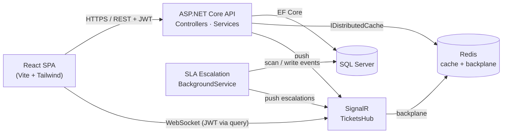
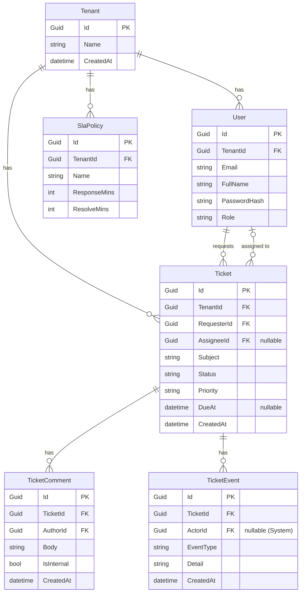

# Triage — Multi-Tenant Support Ticketing Platform

A production-shaped support desk: companies sign up, invite agents, and manage
support tickets with role-based access, SLA deadlines, an append-only audit
trail, and live updates — built to demonstrate the patterns a product team cares
about, not just CRUD.

> **Stack:** .NET 10 Web API · EF Core · SQL Server · SignalR · Redis · React (Vite) · Tailwind

---

## What it does

- **Multi-tenant by design.** Every company is an isolated tenant. A user from
  one tenant can never see another tenant's data — enforced centrally, not
  per-query.
- **Role-based access (Admin / Agent / Requester).** Admins manage users and SLA
  policies; agents work tickets; requesters only ever see their own tickets and
  never see internal notes.
- **Full ticket lifecycle.** Create, assign, change status (Open → Pending →
  Resolved) and priority, comment (public reply or internal note).
- **SLA policies & deadlines.** Admins define response/resolve targets; new
  tickets get a `DueAt`; the dashboard surfaces what's breaching.
- **Append-only audit log.** Every change writes an immutable `TicketEvent`,
  rendered as an activity timeline.
- **Background SLA worker.** A hosted service scans for tickets nearing their
  deadline and escalates them — work that happens outside any HTTP request.
- **Live updates.** Ticket changes and escalations are pushed over SignalR to
  connected clients — toasts, a notification bell, and live dashboard counts,
  no polling.

<!-- Add screenshots here: dashboard, ticket detail, notifications -->

---

## Architecture



A request carries a JWT; the API validates it, derives the tenant and role, and
every database query is auto-scoped to that tenant. Mutations write an audit
event and push a live notification through the hub. The background worker runs
independently of requests. Redis does double duty: a short-TTL cache for
expensive dashboard reads, and the SignalR backplane so live updates survive
horizontal scaling.

---

## Data model



Every tenant-owned table carries `TenantId`. `TicketEvent` is append-only —
rows are inserted, never updated.

---

## Key design decisions

**Multi-tenancy via a shared schema + EF Core global query filter.**
Rather than a database or schema per tenant, every tenant-owned entity has a
`TenantId` and a single global query filter (`HasQueryFilter`) scopes every read
automatically. One place to get right instead of a `WHERE TenantId = …` on every
query — a forgotten filter is a cross-tenant leak, so centralising it is the
safer move. The trade-off is that the filter must be *deliberately bypassed*
(`IgnoreQueryFilters`) for the few legitimate cross-tenant operations: login
lookups and the system background worker.

**Defense in depth — the server enforces, the client only hides.**
Authorization lives on the server: role attributes, requester scoping, and the
internal-notes rule are all enforced in the API. The React app hides controls a
user can't use (the invite button, the internal-note checkbox), but that's
convenience — calling the API directly can't bypass anything.

**DTOs everywhere; entities never leave the API.**
Requests and responses are records, so a password hash can't accidentally
serialize out and the client gets resolved names instead of raw foreign keys.

**Append-only audit via a centralized logger.**
A single `TicketEventService` writes events in the same flow as the change, so
"who did what when" is answerable without mutating history.

**Background work via a hosted service with correct lifetimes.**
The SLA worker is a singleton `BackgroundService`; it creates a DI scope per pass
to resolve the scoped `DbContext`, and bypasses the tenant filter on purpose
because it's a system process scanning all tenants. Escalation is idempotent —
it checks for an existing event before writing, so each ticket escalates once.

**SignalR auth over WebSocket.**
Browsers can't set an `Authorization` header on a WebSocket handshake, so the
JWT is passed as a query-string `access_token` and the bearer handler reads it
for hub paths. Clients join a per-tenant group, so broadcasts stay within a
tenant.

**Redis: cache + backplane, with graceful fallback.**
Dashboard counts are cached with a short TTL and invalidated on write; the cache
key includes the role so per-role visibility doesn't leak through a shared entry.
The same Redis is the SignalR backplane so push works across multiple API
instances. If no Redis connection string is configured, the app falls back to an
in-process cache and single-instance SignalR — so it runs locally with zero
infrastructure.

**Consistent errors via ProblemDetails.**
Validation failures and unhandled exceptions both return RFC 7807 ProblemDetails,
so the frontend has one error contract. Exception detail is surfaced only in
Development.

---

## Project structure

```
triage/                 # ASP.NET Core API
  Controllers/          # Auth, Tickets, SlaPolicies
  Data/                 # AppDbContext (+ global query filter)
  Dtos/                 # request/response records
  Entities/             # Tenant, User, Ticket, TicketComment, TicketEvent, SlaPolicy
  Hubs/                 # TicketsHub (SignalR)
  Services/             # CurrentUser, TokenService, TicketEventService,
                        #   RealtimeNotifier, CacheService
  Workers/              # SlaEscalationWorker (BackgroundService)
  Program.cs

triage.Tests/           # xUnit + EF InMemory tests

triage-web/             # React SPA (Vite + Tailwind)
  src/
    components/         # AppLayout, modals, Toasts, NotificationBell, …
    context/            # AuthContext, RealtimeContext
    pages/              # Login, Register, Dashboard, Tickets, TicketDetail, People, Settings
    api.js              # axios client + endpoint helpers
```

---

## Running locally

### Prerequisites
- .NET 10 SDK
- SQL Server (LocalDB, Express, or container)
- Node.js 20+
- (Optional) Redis — only needed to exercise the cache/backplane; the app runs
  without it.

### Backend
```bash
cd triage

# set your connection string (appsettings.Development.json or user-secrets)
#   ConnectionStrings:DefaultConnection -> your SQL Server
#   Jwt:Key / Jwt:Issuer / Jwt:Audience -> any dev values
# (optional) ConnectionStrings:Redis -> localhost:6379

dotnet ef database update      # apply migrations
dotnet run                      # API on https://localhost:7232, Swagger at /swagger
```

### Frontend
```bash
cd triage-web
npm install
# .env -> VITE_API_URL=https://localhost:7232
npm run dev                     # http://localhost:5173
```

Register a company (that first user becomes Admin), then invite agents and
requesters from the People page.

### (Optional) Redis
```bash
docker run -d -p 6379:6379 redis:alpine
# add to appsettings: "ConnectionStrings": { "Redis": "localhost:6379" }
```

---

## Tests

```bash
dotnet test
```

Covers registration, login (incl. wrong-password rejection), ticket creation
stamping the tenant from the token, tenant isolation (one tenant can't see
another's tickets), and requester scoping. Uses the EF Core InMemory provider so
no database is required.

---

## Deployment (Azure App Service + Azure SQL)

A natural fit for .NET. Outline:

1. **Azure SQL Database** — create a server + database; copy the ADO.NET
   connection string.
2. **App Service (Linux, .NET 10)** — create the web app.
3. **Configuration** — in the App Service *Configuration* blade, set
   `ConnectionStrings__DefaultConnection`, `Jwt__Key`, `Jwt__Issuer`,
   `Jwt__Audience`, and (if used) `ConnectionStrings__Redis` (Azure Cache for
   Redis). Double-underscore maps to the nested config keys.
4. **Migrations** — run `dotnet ef database update` against Azure SQL from CI, or
   generate an idempotent SQL script (`dotnet ef migrations script -i`) and apply
   it in the release.
5. **Frontend** — build (`npm run build`) and host the static output on Azure
   Static Web Apps (or serve from the API's `wwwroot`); point `VITE_API_URL` at
   the App Service URL and add that origin to the API's CORS policy.
6. **Scale-out** — when running more than one App Service instance, Azure Cache
   for Redis is required so the SignalR backplane keeps live updates working
   across instances.

---

## Demo Access

## Demo Access

To help recruiters and interviewers evaluate the application quickly, demo accounts are provided below.

> **Note:** The backend API is hosted on Render Free Tier. The first request may take 30-60 seconds to wake up the server.

### Live Demo

Frontend: https://triage-web-ashy.vercel.app

Backend API: https://triage-api-h80s.onrender.com

---

### Admin Demo

Email: `admin@demo.com`

Password: `Demo@123`

The Admin account can:

* Manage users
* Configure SLA policies
* View all tickets
* Assign tickets
* Access dashboard analytics
* Monitor escalations and audit logs

---

### Agent Demo

Email: `agent@demo.com`

Password: `Demo@123`

The Agent account can:

* View assigned tickets
* Update ticket status
* Add public replies and internal notes
* Receive real-time notifications

---

### Requester Demo

Email: `requester@demo.com`

Password: `Demo@123`

The Requester account can:

* Create support tickets
* View only their own tickets
* Reply to tickets
* Track ticket progress in real time

---

> Demo data may be reset periodically to maintain a clean evaluation environment.


## Possible next steps

- Persist notifications server-side so the bell survives a refresh.
- SLA policy *edit* UI (the API already supports `PUT`).
- Full HTTP-pipeline integration tests via `WebApplicationFactory`.
- Consolidate the schema onto EF migrations as the single source of truth.
